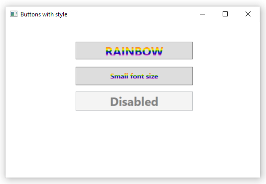
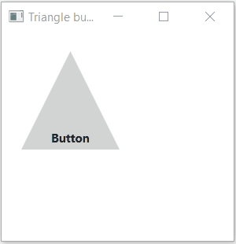
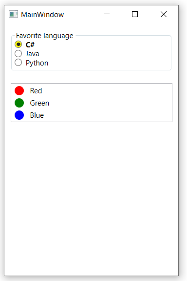

# Exercises - Chapter 2 - WPF Controls

## Exercise 1
Create a WPF application that resembles the following screenshot:

![alt text][img_exercise1]
 
The first button is a standard button.

The second button should hold an image as well as bold text with a bigger fontsize (16). The image can be found in the *images* folder.
Tip: a *StackPanel* can hold multiple controls and positions them vertically.

The bottom button must have white bold text and a gradient as background (Tip: *LinearGradientBrush*). 
The gradient must move from yellow to red to blue and finally to green with equal distance between the color transitions.

Place the buttons in a single-cell *Grid*.

Do all of this **purely in XAML**. Do not change MainWindow.xaml.cs.

## Exercise 2
In this exercise you'll have to apply styles on buttons.
Add a style for buttons to your window resources so you can use it on multiple buttons in the window. 
Add 3 buttons to the window and try to make them resemble the screenshot as good as possible by applying your custom style.
The background of the buttons should be a gradient that flows vertically. 
It starts with the color *LimeGreen*, is *Green* in the middle and ends with the color *LimeGreen* again.

The middle button should have a bigger font size.

The bottom button should be disabled. Notice how a different background is applied when the button is disabled (this is baked in the *Template* of the *Button* control).

![alt text][img_exercise2]

Do all of this **purely in XAML**. Do not change MainWindow.xaml.cs.

## Exercise 3
Create an application that looks like the image below:

![alt text][img_exercise3]

When the *Grow* button is pressed and the button keeps being pressed down, then the rectangle keeps growing 10 pixels in width.
When the *Shrink* button is pressed and the button keeps being pressed down, then the rectangle keeps shrinking 10 pixels in width.
Position the rectangle in a canvas. 
Make sure the width of the rectangle does not shrink below zero. 
Also make sure the width of the rectangle does not exceed the edge of the canvas. 

Tip: use instances of *RepeatButton*.

## Exercise 4
Create a WPF application that resembles the following screenshot:

![alt text][img_exercise4]

The first button should be a customized *ToggleButton*. When the button is pressed the text on the button changes from "Uit" to "Aan" and visa versa.
Use a *Style* to achieve this.

Add a group of three checkboxes that enables the user to select multiple age groups. Make sure the default selection (when the application starts) matches the selection in the screenshot (checked - not checked - not checked).

Add a group of radiobuttons than enables the user to select a gender. Make sure that "Man" is checked by default (when the application starts).

All controls should be positioned in a *Canvas*.

Do all of this **purely in XAML**. Do not change MainWindow.xaml.cs.

## Exercise 5
Create a WPF application that resembles the following screenshot:

![alt text][img_exercise5]

The necessary images can be found in the *images* folder in the project for this exercise.
Use a *TreeView* control.

Do this **purely in XAML**. Do not change MainWindow.xaml.cs.
 
## Exercise 6
This exercise is about event bubbling and tunneling.

The application (already) contains a button for each digit. When a digit button is pressed the matching digit should be appended in the textbox at the top.
You may only wire up one click event handler (this must be done in XAML) that catches the click event for all buttons.

It is also possible to directly type digits in the textbox. Make sure it is not possible to type non-digit characters in the textbox.
Use event tunneling to achieve this. 
Tip: you can use the static *Char.IsDigit* method to check if a character is a digit.

![alt text][img_exercise6]

## Exercise 7
Create a WPF application with a *ListView* that resembles the following screenshot:

![alt text][img_exercise7]

The necessary images can be found in the *images* folder in the project for this exercise.

Do this **purely in XAML**. Do not change MainWindow.xaml.cs.

## Exercise 8
Create a round button like in the screenshot below:

![alt text][img_exercise8]

To achieve this you need to create a custom template for button controls. 
Define this template as an application resource so that you can have round buttons in all future windows of the application. 

The content of the template should be a grid that contains 2 ellipses that both stretch to the borders of the grid. 
One ellipse (the inner ellipse) should get some margin to create the border effect. 
The outer ellipse has a gradient from *Green* to *Purple*. 
The inner ellipse has a gradient from *LightBlue* to *Blue*.
Position a *ContentPresenter* in the center of the grid (this is where the *Content* of the round buttons will be placed).

When you move the mouse over the button the color of the outer ellipse should become *Black*. Use a *Trigger* to achieve this.

When you click on the button a push effect should be simulated by shrinking the button to 80% of its size. 
When the button is released its size grows back to 100%. This can also be achieved with a *Trigger* that applies a *ScaleTransform* that originates in the center of the button.

Do all of this **purely in XAML**. Do not change MainWindow.xaml.cs.

## Exercise 9
Create a WPF application that resembles the following screenshot:

The window contains a *Grid* that holds 3 checkboxes in a single cell.

The first *CheckBox* is a standard checkbox.

The second *CheckBox* has a *StackPanel* as content. 
The *StackPanel* shows an image of a kameleon and some bigger, bold text next to it. 
The image can be found in de *Images* folder of the project.

The *CheckBox* at the bottom has a *Yellow* *Background*. 
The *Content* of the *CheckBox* is some bold, white colored text with a linear gradient brush as background. 
The gradient brush should be *Red* on the left, *Blue* in the middle and *Green* at the right.

Do all of this **purely in XAML**. Do not change MainWindow.xaml.cs.

## Exercise 10
In this exercise you'll have to apply styles on buttons.

Add a style for buttons to your window resources so you can use it on multiple buttons in the window. 
Add 3 buttons to the window and try to make them resemble the screenshot as good as possible by applying your custom style.
The background of the buttons should be a circular (radial) gradient. 
It should alternate 2 colors. The first color starts in the center. Then at 40% the color should be the second color. At the end the gradient should be the first color again.

The middle button should have a bigger font size.

The bottom button should be disabled. Notice how a different background is applied when the button is disabled (this is baked in the *Template* of the *Button* control).

Do all of this **purely in XAML**. Do not change MainWindow.xaml.cs.

## Exercise 11
Create a triangle button like in the screenshot below:

To achieve this you need to create a custom template for button controls. 
Define this template as an application resource so that you can have triangle buttons in all future windows of the application. 

The content of the template should be a grid with one cell that holds a *Polygon* (the triangle) and a *ContentPresenter*. 
The color of the *Polygon* should be *LightGray*.
Define the *Points* of the *Polygon* as if the triangle should be in a square with the top left corner at position (0.0, 0.0) and the bottom right corner at position (1.0, 1.0). 
Set the 'Stretch' property of the *Polygon* to fill the available space of the grid cell.
Position the *ContentPresenter* in the horizontal center and the vertical bottom of the grid cell (this is where the *Content* of the triangle buttons will be placed). 
Use some *Margin* to have a little bit of space between the bottom and the content.

When the button is clicked the *Grid* (and the triangle inside it) should do one clockwise rotation in 250 milliseconds. 

Do all of this **purely in XAML**. Do not change MainWindow.xaml.cs.

## Exercise 12
Create a WPF application that resembles the following screenshot:

Add a group of three radiobuttons that enables the user to select a favorite programming language. 
Make sure the first radiobuttion is checked by default (when the application starts).

All *RadioButtons* in the window should automatically have a custom *Style* applied to it (without having to specifiy the style for each radiobutton). 
The *Style* should change the *Background* to *Yellow* and the *FontWeight* to *Bold* when the radiobutton is checked.

Ass a *ListView* that shows at least 3 colors.
Each color should be displayed with a colored circle and the name of the color next to it. Make sure there is some space between the circle and the text. 

All controls should be positioned in an outer *StackPanel* (=*Content* element of the window).

Do all of this **purely in XAML**. Do not change MainWindow.xaml.cs.

[img_exercise1]:images/exercise1_mainwindow.png "Main window of exercise 1"
[img_exercise2]:images/exercise2_mainwindow.png "Main window of exercise 2"
[img_exercise3]:images/exercise3_mainwindow.png "Main window of exercise 3"
[img_exercise4]:images/exercise4_mainwindow.png "Main window of exercise 4"
[img_exercise5]:images/exercise5_mainwindow.png "Main window of exercise 5"
[img_exercise6]:images/exercise6_mainwindow.png "Main window of exercise 6"
[img_exercise7]:images/exercise7_mainwindow.png "Main window of exercise 7"
[img_exercise8]:images/exercise8_mainwindow.png "Main window of exercise 8"