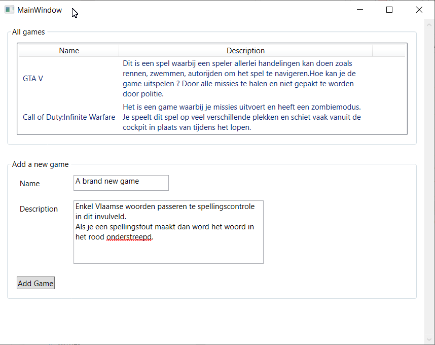

# Exercises - Chapter 4 - WPF Databinding

## Exercise 1
Use *OneWay* databinding to show a game object on the screen. 

The UI (XAML) is given. You only have to add the bindings.

The *Game* class is also given. And the constructor of the *MainWindow* already creates a game object.

## Exercise 2
In this exercise you will also visualise game objects in the UI.
This time it is just a little bit more complicated.

The *Game* class is given and contains a few more properties compared to exercise 1.

The user can select 1 of 7 games in a ComboBox. The properties of the selected game are displayed in the UI. 
It is also possible to change the rating of a game by clicking on the *Up* or *Down* button. 
All changes in the UI (e.g. change the name of a game) should be reflected in the game object the UI is showing.

The UI (XAML) is (partially) given. You have to add the bindings and make sure the games are displayed correctly in the combobox. 
In the combobox each item is displayed as *Game Id - Name* (Use a *StackPanel* and databinding to achieve this).

The ratings of the game objects in memory are doubles between 0.0 and 10.0. 
Use a converter to display the ratings in the UI as doubles between 0.0 and 100.0. 
The converter will need to work in 2 directions. 
The (empty) converter class *RatingConverter* is already present in the code (*Converters\RatingConverter.cs*). 

## Exercise 3
In this exercise you will create a window that show a list of games and also a form to add a new game to the list. 

Het overzicht van games moet getoond worden met ee *ListView* met 2 kolommen: 
* Een kolom met als hoofding **Name**. De breedte van deze kolom past zich aan de inhoud aan.
* Een kolom met als hoofding **Description**. Deze kolom krijgt een vaste breedte. 

De rijen in de *ListView* worden gekoppeld aan een collectie van *Game* objecten. 
De initiële games worden in de codebehind geladen. Maak hierbij gebruik van de *GetDummyGames* methode. 
Zorg ervoor met behulp van databinding dat de juiste waarden in de rijen getoon worden. 
Voor de *Description* moet je ervoor zorgen dat de (lange) tekst gewrapped wordt in de beschikbare ruimte (breedte) van de kolom. Tip: definieer een eigen *CellTemplate* voor de *Description* kolom.

Om een nieuwe game aan te maken, maak je ook gebruik van databinding. Hierbij koppel je de invulvelden aan een achterliggend *Game* object. 
Na het klikken op de knop wordt de ingevulde game toegevoegd aan de *ListView*. Dit moet automatisch gebeuren als je de collectie van games die aan de *ListView* gebonden is, wijzigt. 
Na het toevoegen van een game moet het ook mogelijk zijn om een volgende game toe te voegen.

Als er geen naam of omschrijving is ingevuld, dan wordt een foutboodschap weergegeven in de daarvoor voorziene *TextBlock*. 
Na het succesvol toevoegen van een game, wordt een eventuele (vorige) foutboodschap terug gewist. 

Zorg er ook voor dat het scherm een scrollbar toont als de inhoud een grotere hoogte heeft als het venster.