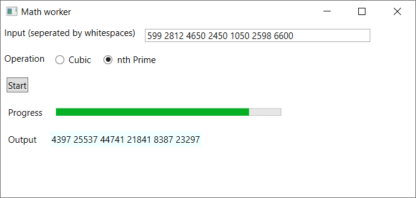
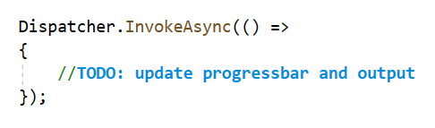

# Exercises - Chapter 5 - C# Language Features

## Exercise 1 (Balloon program)

In this exercise you will be creating a console application 
that randomly creates some (at least 5) instances of a *Balloon* class and outputs the size and color of each balloon.
The program also randomy picks one of the created balloons that will be popped. 
In the output you can read which balloon was popped.

The *Balloon* class is given (*Balloon.cs*) and should not be changed.

To make it more easy to randomly create or pick a balloon you should create 2 extension methods that extend the *Random* class:

* *NextBalloon*: returns a *Balloon* with a random color and a random size. The maximum size (inclusive) should be passed in as a parameter.
* *NextBalloonFromArray*: accepts an array of *Balloon* and randomly returns one of the balloons in the array.

Write the class that contains the extension methods in the file *RandomExtensions.cs*.

Tip: use the static *[FromArgb](https://docs.microsoft.com/en-us/dotnet/api/system.drawing.color.fromargb?view=netcore-3.1#System_Drawing_Color_FromArgb_System_Int32_System_Int32_System_Int32_)* method of the *Color* class to create an instance of *Color*.

When the extension methods are written, redirect your focus on the *BalloonProgram* class.
A *BalloonProgram* has a *Run* method. In the *Run* method you should create an array of (at least 5) balloons. 
Use the *NextBalloon* extension method to fill the array with random balloons (you may choose a maximum size). 

Next an informative line should be written to the output for each balloon (see screenshot above). 
The output can be any number of things: it could be the console window, but it could also be the debug window or even a file.

To make an abstraction of how or where the output is written, you can use a delegate. 
Define a delegate type in *WriteDelegate.cs* that enforces the following signature for subscribing methods: 
* return type must be void
* there must be one parameter of type string (the string that must be written to the output)

Inject the delegate you created in *BalloonProgram* by passing is as a parameter in the constructor.
Store the injected delegate in a private field so that you can use the delegate in the *Run* method.
Now you can write information about a balloon to the (unknown) output.

In the *Run* method, pick a random balloon to pop from the array (using an extension method). 
Write to the output which balloon you popped. 
E.g. *"Popped ballon of size '58' and color 'Color [A=255, R=73, G=157, B=183]'"*. 
You can use the *ToString* method of the *Color* class to get a string representation of a color.

Lastly you will have make sure that the *Main* program (*Program.cs*) runs a *BalloonProgram*.
The delegate instance should have 2 subscribers:
* a method that writes a message to the *Console*. For this you can use *Console.WriteLine*.
* a method that writes a message to The *Debug output*. For this you can use *Debug.WriteLine*. Messages that are written to the *Debug output* should be fully uppercase.

Now you can create an instance of *BalloonProgram* and run it.

When the program runs you should see the output appear in the console window and in the debug output.

## Exercise 2 (Math worker)

In this exercise you will be creating a WPF application that 
* accepts a list of whole numbers (seperated by whitespaces)
* lets the user choose a mathematical operation
     * Cubic: for a given number x the result should be *3x³ + 2x² +x*
     * nth prime: for a given number n the result should be the nth prime number *(f(1) = 2, f(2)=3, f(3) = 5, f(5)=11, ...)*
* calculates the result of the selected operation on each number of the input
* shows progress after each calculation
* outputs the result of each calculation

### CalculationWorker
The calculation worker is a class that can execute a math operation on a series of number inputs. 
The *DoWork* method can execute any math operation that takes a whole number (int) as input and returns a whole number (long). 
It executes the operation for each number in an array of numbers.

The *DoWork* method might take a long time to execute. That's why the calculations are executed in a seperate thread. 
Otherwise the user interface would freeze as long as the method is running. 
In the body of the *DoWork* method you can see a call to *Task.Factory.StartNew* which takes an *Action* delegate as parameter. 
This creates runs the action in a new thread. The action should contain the logic that does the calculations. 

Write code that executes the math operation for each number in the array. 
Each time a calculation is executed the worker should let subscribers know that a calculation has completed. 
Add an event to the worker class to make this work. The event should be of type *CalculationCompleteHandler* (which is given in code). 

### MathOperationFactory
The *MathOperationFactory* is a class that is responsible for creating math operations. 
Use lambda expressions to create these operations in the *CreateCubicOperation* and *CreateNthPrimeOperation* methods. 
To implement the *CreateNthPrimeOperation* you can make use of the private helper method *IsPrime* which checks if a number is a prime number. 

### MainWindow
The XAML code of the UI is given. You do not need to change anything here.

The constructor will receive an instance of *IMathOperationFactory* (see code in *App.xaml.cs*). 
Store the operation factory in a (readonly) field. 
Also add and initialize a (readonly) field of type *CalculationWorker*. 

When the start button is clicked the input is parsed an converted to an array of int. 
Depending on which radiobutton is checked a math operation is created using the factory that was passed in the constructor. 
Then the worker can do its thing.

Subscribe to the event of the worker to be able to update the progressbar and output textblock. 
Because the events that are received from the worker come from another thread you will get an error when you try to change the progressbar value or the output textblock. 
To solve this you need to wrap the code in the event handler method as follows: 

