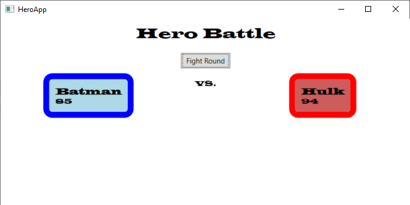
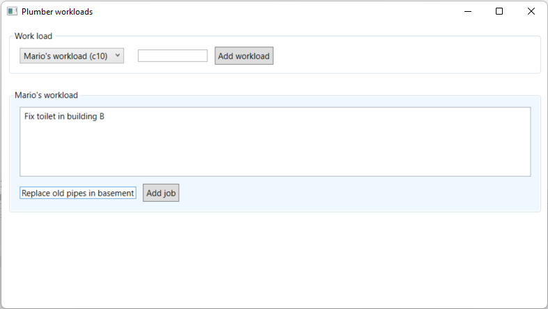
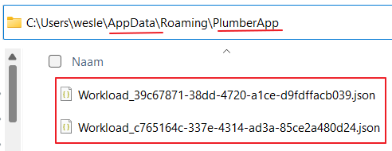

# Exercises - Chapter 7 - Layered Architecture

## Exercise 1 (Heroes)
In this exercise you will be creating a desktop application 
that randomly creates a battle between 2 heroes. 
The 2 heroes attack each other round by round. 
When the health of one of the heroes reaches zero the fight ends and the button is disabled.

When one hero attacs another hero, the attack strength (1-100) determines the damage on the health of the other hero. 
Each hero has a *supermode likeliness*. This is the chance that the attack of a hero does double damage or a defend against an attack halfs the damage received. 
In each round figher 1 attacks fighter 2 and fighter 2 then attacks fighter 1.
Changes in health should be reflected on screen.

Your solution should be organized in a proper layered structure. 

### Domain
Start with the domain layer. This layer already exposes some public interfaces (in the *Contracts* folder). 
You must create the concrete implementations and hide these implementations from the other layers (so that they are forced to use the public interfaces).
Other layers must use the factory interfaces to create instances of *Hero* or *Battle*.

Use the automated tests to guide you in the right direction.

Tip for the factory implementations:

The concrete implementation of e.g. the *IHeroFactory* will need access to the (private) constructor of the *Hero* class. 
You can achieve this by nesting a *Factory* class inside the *Hero* class definition. 
See [https://docs.microsoft.com/dotnet/csharp/programming-guide/classes-and-structs/nested-types](https://docs.microsoft.com/dotnet/csharp/programming-guide/classes-and-structs/nested-types).

### AppLogic
When the domain layer is in place, implement the application logic layer. 

Use the automated tests to guide you in the right direction.

### Infrastructure
When the application logic layer is in place, implement the infrastructure layer.

Use the automated tests to guide you in the right direction.

### Presentation
When the infrastructure layer is in place, implement the presentation (UI) layer.

Use the automated tests to guide you in the right direction.

## Exercise 2 (Plumber)
In this exercise you will be creating a desktop application 
that can be used to manage the workload of different plumbers. 
Each plumber in the company has a workload. 
A workload is a collection of jobs for the plumber and has a certain capacity. 
In this first version each workload has a capacity of 10 jobs. 
This means that a plumber can plan ahead for a maximum of 10 jobs.

It is possible to add a new workload by filling in the name of the workload (plumber) in the textbox and clicking on the *Add workload* button.

To edit a workload, you can select a workload in the dropdownlist. 

When a workload is selected, the list of jobs in the workload is displayed. 
It is possible to add a new job by filling in the textbox and clicking on the 'Add job' button. 

The workloads are stored in the *AppData* folder of file system. 
Each workload is stored in a json format in its own file.

Your solution should be organized in a proper layered structure. 

### Domain
Start with the domain layer. This layer already exposes some public interfaces (*IWorkload* and *IJob*). 
You must create the concrete implementations. 

The concrete implementation of the *IJob* interface should be hidden from the other layers, since a job should always be created via the workload, not directly.

Use the automated tests to guide you in the right direction.

### AppLogic
The application logic layer only defines an interface for storing en retrieving workloads (*IWorkloadRepository*). 

For this exercise there will be no service implementations needed.

### Infrastructure
Implement the infrastructure layer. Here you will provide a concrete implementation for *IWorkloadRepository*. 
The concrete repository will store the workloads as files in the *AppData* folder.

Use the automated tests to guide you in the right direction.

### Presentation (UI)
When the infrastructure layer is in place, implement the presentation (UI) layer.

The XAML code is already given.

Use the automated tests to guide you in the right direction.
